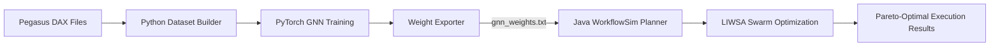

# 🦗 WorkflowSim — GNN-Enhanced & Locust-Inspired Workflow Scheduling

<p align="center">
  
  
  
  
  
  
</p>

<p align="center">
  <b>Structure-Aware Graph Neural Networks & Density-Adaptive Swarm Optimization for Cloud Workflow Scheduling</b><br>
  <i>Dr. Mohammed Alaa Ala'anzy — SDU University, Kazakhstan</i>
</p>

---

> *Desert locusts don't follow a timer; they respond to crowding. LIWSA brings this mechanism into cloud workflow scheduling, while Graph Neural Networks (GNN) learn structural DAG patterns to guide the swarm search.*

---

## 🚀 Overview

This repository provides a unified framework combining **LIWSA** (Density-Adaptive Locust Swarm Optimisation) and its **GNN-based Warm-Start Extension** for cloud workflow scheduling inside [WorkflowSim 1.1.0](https://github.com/Al3nzy/WorkflowSim_GNN_LocustOptimisation/tree/main) and [CloudSim 3.0](https://github.com/Al3nzy/WorkflowSim_LocustModeling).

The system combines:
1. **Python GNN Training Pipeline**: Learns task execution metrics from DAG structural topology and exports standalone model weights.
2. **Pure-Java WorkflowSim Extension**: Loads exported model weights without heavyweight native ML dependencies to initialize Pareto swarm optimization.
3. **Multi-Algorithm Benchmarking**: Integrated baseline comparisons including HEFT, Min-Min, MLEAO, LIWSA, LIWSA-ML, and LIWSA-GNN.

---

## 🧠 Core Algorithms

### 1. LIWSA (Locust-Inspired Workflow Scheduling Algorithm)
A multi-objective swarm optimization algorithm where candidate schedules switch between solitary and gregarious phases based on local crowding density $\rho_i$. It produces a true Pareto front across **Makespan** and **Execution Cost** without needing scalar weights or objective normalization.

### 2. LIWSA-ML (OLS Warm-Start)
Injects ordinary least-squares (OLS) regression predictions directly into the initial swarm population based on topological features, task fan-in/out, and VM processing speeds.

### 3. LIWSA-GNN (Graph Neural Network Warm-Start)
Extends swarm initialization using a Graph Neural Network (GNN) trained on workflow DAG structures. The GNN embeds DAG nodes and message-passing dependencies to predict task metrics across varying workflow scales.

---

## 📁 Repository Structure

```text
├── config/dax/                         # Benchmark scientific DAG inputs (.xml)
├── sources/org/workflowsim/            # Java WorkflowSim Core & Planning
│   ├── WorkflowPlanner.java            # Main planner dispatcher
│   ├── planning/
│   │   ├── LIWSAGNNPlanningAlgorithm.java # GNN-guided planner implementation
│   │   ├── LIWSAPlanningAlgorithm.java   # Core LIWSA implementation
│   │   ├── LIWSAMLPlanningAlgorithm.java # OLS-boosted LIWSA implementation
│   │   ├── HEFTPlanningAlgorithmExample1.java
│   │   ├── MLEAOPlanningAlgorithmExample.java
│   │   ├── ParetoMetrics.java          # Hypervolume metrics calculator
│   │   ├── ResultsCsvWriter.java       # Standardized CSV exporter
│   │   └── RunMetricsCalculator.java   # Performance metrics evaluator
├── gnn_weights.txt                     # Exported GNN model weights for Java runtime
├── build_dataset.py                    # Constructs PyTorch base datasets
├── build_family_datasets.py            # Generates family-specific datasets
├── build_augmented_dataset.py          # Data augmentation via synthetic DAGs
├── model.py                            # PyTorch GNN architecture definition
├── decoder.py                          # Schedule decoding logic
├── dax_parser.py                       # Pegasus DAX XML parser
├── train_baseline.py                   # Structure-blind baseline training
├── train_production.py                 # Production GNN model training
├── run_one_seed.py                     # Single-seed execution runner
├── run_family_multiseed.py             # Multi-seed held-out family evaluation
├── export_weights.py                   # Exports PyTorch weights to gnn_weights.txt
├── verify_plain_forward.py             # Validates Java-side forward pass math
└── gnn_benchmark_results.csv           # Benchmark execution results
```

---

## 🔄 Execution Workflow



---

## 📊 Experimental Benchmark Results (LIWSA-GNN)

Experimental results for **LIWSA-GNN** across 15 scientific workflow instances from the Pegasus Workflow Gallery (evaluated across 5 random seeds):

| Workflow | Tasks | Avg Makespan (s) | Avg Cost ($) | Avg Sim Wallclock (s) |
| :--- | :---: | :---: | :---: | :---: |
| **CyberShake_30** | 30 | 394.60 | 815.78 | 0.082 |
| **CyberShake_50** | 50 | 559.57 | 1,631.05 | 0.150 |
| **CyberShake_100** | 100 | 966.36 | 3,350.46 | 0.326 |
| **Epigenomics_24** | 24 | 4,015.80 | 8,384.21 | 0.082 |
| **Epigenomics_46** | 46 | 7,695.44 | 19,942.00 | 0.154 |
| **Epigenomics_100** | 100 | 55,835.70 | 199,899.00 | 0.346 |
| **Inspiral_30** | 30 | 853.61 | 3,141.33 | 0.084 |
| **Inspiral_50** | 50 | 1,352.08 | 5,623.66 | 0.144 |
| **Inspiral_100** | 100 | 2,896.56 | 9,930.78 | 0.310 |
| **Montage_25** | 25 | 47.30 | 105.73 | 0.242 |
| **Montage_50** | 50 | 84.01 | 242.82 | 0.172 |
| **Montage_100** | 100 | 136.15 | 536.31 | 0.346 |
| **Sipht_30** | 30 | 2,207.63 | 2,498.77 | 0.212 |
| **Sipht_60** | 60 | 2,332.87 | 5,256.17 | 0.406 |
| **Sipht_100** | 100 | 2,438.34 | 8,268.49 | 0.674 |

---

## 🛠️ Execution & Quick Start

### Step 1: Python Pipeline (Dataset & GNN Model Export)

Run the Python scripts in sequence from the repository root:

```bash
# 1. Construct initial training/testing datasets from DAX inputs
python build_dataset.py

# 2. Perform initial training run across seeds
python run_one_seed.py 1

# 3. Construct family-based datasets for held-out cross-family evaluation
python build_family_datasets.py

# 4. Run multi-seed evaluation across families
python run_family_multiseed.py

# 5. Train the final production model on the complete dataset
python train_production.py

# 6. Export model weights into gnn_weights.txt (used by Java)
python export_weights.py

# 7. Validate mathematical correctness between PyTorch and exported weights
python verify_plain_forward.py
```

Step 6 generates `gnn_weights.txt` in your working directory.

---

### Step 2: Run Java Benchmarks

Compile and execute the simulation:

```bash
# Compile the Java planner
javac -cp ".:workflowsim.jar:lib/*" sources/org/workflowsim/planning/LIWSAGNNPlanningAlgorithm.java

# Run a single GNN-guided simulation run
java -cp ".:workflowsim.jar:lib/*" org.workflowsim.examples.planning.LIWSAGNNPlanningAlgorithmExample

# Run full benchmark evaluation
java -cp ".:workflowsim.jar:lib/*" org.workflowsim.examples.planning.LIWSABenchmarkExample
```

---

## 📚 Scope & Generalization Notes

* **Scale Generalization**: The GNN predictor is validated for generalizing across **problem sizes** within the workflow families included in training (e.g., predicting on 1000-task workflows when trained on smaller instances).
* **Cross-Family Transfer**: Cross-family transfer to completely unseen DAG topologies requires synthetic data augmentation during pre-training.

---

## 📄 License

Copyright 2025–2026 SDU University, Kazakhstan.  
Licensed under the [Apache License, Version 2.0](https://www.apache.org/licenses/LICENSE-2.0).