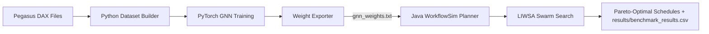

# 🦗 WorkflowSim — LIWSA & LIWSA-GNN Cloud Workflow Scheduling

<p align="center">
  
  
  
  
  
  
</p>

<p align="center">
  <b>Direction-Aware Graph Neural Network Warm-Starting for a Density-Adaptive Swarm Search over Cloud Workflow Schedules</b><br>
  <i>Mohammed Alaa Ala'anzy — SDU University, Kazakhstan</i>
</p>

---

> *Desert locusts don't follow a timer; they respond to crowding. LIWSA brings this mechanism into cloud workflow scheduling. LIWSA-GNN warm-starts LIWSA's initial population with a graph neural network that reads the workflow's actual task-dependency structure, rather than flattening it into per-task summary statistics.*

---

## 🚀 Overview

This repository implements **LIWSA** (a density-adaptive, locust-inspired multi-objective swarm search for cloud workflow scheduling) and **LIWSA-GNN** (its direction-aware graph neural network warm-start extension) inside [WorkflowSim 1.1.0](https://github.com/Al3nzy/WorkflowSim_GNN_LocustOptimisation/tree/main) and [CloudSim 3.0](https://github.com/Al3nzy/WorkflowSim_LocustModeling).

The system has two parts:
1. **Python GNN training pipeline**: builds training data from Pegasus DAX workflow files, trains the direction-aware message-passing GNN, and exports its weights to a plain-text file.
2. **Pure-Java WorkflowSim planner**: loads those exported weights (no PyTorch, no native ML runtime) to warm-start LIWSA's population, then runs the swarm search inside WorkflowSim/CloudSim.

Baseline comparators included for benchmarking: HEFT, Min-Min, and MLEAO (a reimplementation of the Archimedes Optimization Algorithm adapted to multi-objective workflow scheduling).

---

## 🧠 Core Algorithms

### 1. LIWSA (Locust-Inspired Workflow Scheduling Algorithm)
A multi-objective swarm search where each candidate schedule switches between solitary and gregarious search operators based on local crowding density $\rho_i$, producing a true Pareto front across **makespan** and **execution cost** without scalarising the two objectives.

### 2. LIWSA-GNN (Graph Neural Network Warm-Start)
Warm-starts LIWSA's initial population with a direction-aware message-passing GNN trained on workflow DAG structure. The GNN aggregates each task's features separately from its parents and its children, is deployed as a fitness oracle that scores complete candidate genotypes, and its top-ranked candidates seed the swarm.

---

## 📁 Repository Structure

```text
├── config/dax/                          # Benchmark scientific DAG inputs (.xml)
├── sources/org/workflowsim/             # Java WorkflowSim core & planning
│   ├── WorkflowPlanner.java             # Main planner dispatcher
│   └── planning/
│       ├── LIWSAGNNPlanningAlgorithm.java # GNN-warm-started planner
│       ├── LIWSAPlanningAlgorithm.java    # Core LIWSA swarm search
│       ├── HEFTPlanningAlgorithmExample1.java
│       ├── MLEAOPlanningAlgorithmExample.java
│       ├── ParetoMetrics.java           # Hypervolume / Pareto-front metrics
│       ├── ResultsCsvWriter.java        # Standardised CSV exporter
│       └── RunMetricsCalculator.java    # Performance metrics evaluator
├── examples/org/workflowsim/examples/planning/
│   └── LIWSABenchmarkExample.java       # Full benchmark runner (all algorithms, all instances)
├── gnn_weights.txt                      # Exported GNN weights consumed by the Java planner
├── training_data.py                     # Shared DAX loading + sampling routines
├── model.py                             # PyTorch GNN architecture
├── decoder.py                           # Schedule decoding logic
├── dax_parser.py                        # Pegasus DAX XML parser
├── train_baseline.py                    # Structure-blind ablation baseline
├── build_dataset.py                     # Scale-generalisation train/test split
├── build_family_datasets.py             # Topology-generalisation (family-holdout) splits
├── build_production_dataset.py          # Pooled, non-held-out dataset for the deployed model
├── run_one_seed.py                      # Single-seed scale-generalisation run
├── run_family_multiseed.py              # Multi-seed topology-generalisation run
├── train_production.py                  # Trains the single deployed model
├── export_weights.py                    # PyTorch weights -> gnn_weights.json
├── verify_plain_forward.py              # gnn_weights.json -> gnn_weights.txt, plus a numerical correctness check
└── results/benchmark_results.csv        # Full benchmark output (all algorithms, all instances, all seeds)
```

---

## 🔄 Execution Workflow



---

## 🛠️ Quick Start: Python, Then Java

### Step 1: Python pipeline (dataset construction, GNN training, weight export)

Run from the repository root. A virtual environment is recommended (see the VS Code section below).

```bash
# 1. Scale-generalisation split: train on small/medium instances, hold out the five largest
python build_dataset.py

# 2. Train + evaluate the scale-generalisation ablation for one seed (repeat for seeds 1-5)
python run_one_seed.py 1

# 3. Topology-generalisation splits: one held-out family at a time
python build_family_datasets.py

# 4. Train + evaluate the topology-generalisation ablation, all five families, five seeds each
python run_family_multiseed.py

# 5. Build the pooled, non-held-out dataset for the deployed model
python build_production_dataset.py

# 6. Train the single production model deployed to the Java planner
python train_production.py

# 7. Export the trained weights
python export_weights.py

# 8. Convert to the plain-text format the Java planner loads, and check
#    PyTorch/Java numerical agreement
python verify_plain_forward.py
```

Step 8 writes `gnn_weights.txt` to the repository root; this is the file the Java planner reads at scheduling time. Steps 1-4 are for reproducing the generalisation ablations reported in the paper and are not required just to run the scheduler; steps 5-8 are the minimum needed to (re)produce a deployable model.

> **Note:** `build_production_dataset.py` reconstructs the production training set by pooling samples from all five workflow families at all four instance sizes, following the same per-workflow sampling routine as `build_dataset.py`. If you already have a `production_data.pkl` from an earlier run, place it in the repository root and skip step 5; `train_production.py` will use it as-is.

### Step 2: Java benchmark

Compile and run using the source folders and bundled libraries directly (there is no separate `workflowsim.jar`; `sources/` and `examples/` are compiled together):

```bash
# Compile everything
javac -d bin -cp "lib/*" -sourcepath "sources:examples" \
  examples/org/workflowsim/examples/planning/LIWSABenchmarkExample.java

# Run the full benchmark: HEFT, Min-Min, MLEAO, LIWSA, and LIWSA-GNN
# across all 20 benchmark instances and 5 seeds each
java -cp "bin:lib/*" org.workflowsim.examples.planning.LIWSABenchmarkExample
```

This writes `results/benchmark_results.csv`, one row per (workflow instance, algorithm, seed), with makespan, cost, hypervolume, Pareto front size, fairness index, resource utilisation, and speedup.

---

## 💻 Using VS Code

This project already carries Eclipse-style `.project`/`.classpath` metadata, which VS Code's Java tooling reads natively, so no separate Java project setup is needed beyond installing the extension.

**One-time setup:**
1. Install the **Extension Pack for Java** (`vscjava.vscode-java-pack`) and the **Python** extension (`ms-python.python`) from the Extensions view.
2. Open the repository root folder in VS Code (`File > Open Folder...`). The Java extension will detect `.classpath` automatically and index `sources/` and `examples/` as source folders with `lib/*.jar` on the build path; watch the bottom status bar for "Java: Ready".
3. Open a terminal in VS Code (`` Ctrl+` ``) and create a Python virtual environment for the training pipeline:
   ```bash
   python -m venv .venv
   source .venv/bin/activate        # Windows: .venv\Scripts\activate
   pip install torch numpy
   ```
   Select this environment as the interpreter via the Python extension (`Ctrl+Shift+P` → "Python: Select Interpreter").

**Running the Python pipeline:** open any `.py` file listed in Step 1 above and use Run/Debug (`F5`), or run the commands directly in the integrated terminal with the virtual environment active.

**Running the Java benchmark:** open `examples/org/workflowsim/examples/planning/LIWSABenchmarkExample.java`; the Java extension shows a `Run | Debug` code lens above `public static void main`. Clicking `Run` compiles and executes using the classpath from `.classpath` automatically, writing to `results/benchmark_results.csv` exactly as the command-line invocation above does.

---

## 📚 Scope & Generalisation Notes

* **Scale generalisation** (train on small/medium instances, test on the five largest of the same families): LIWSA-GNN shows a consistent held-out prediction advantage over a depth- and width-matched structure-blind baseline across all five seeds.
* **Topology generalisation** (train on four families, test on a fifth never seen at any scale): the result is family-dependent rather than uniform. Two families favour LIWSA-GNN, one favours the baseline, and two show no reliable difference. This is a real, seed-replicated finding, not a gap to be closed with more data augmentation; see the paper for the full breakdown and discussion.

---

## 📄 License

Copyright 2025–2026 SDU University, Kazakhstan.
Licensed under the [Apache License, Version 2.0](https://www.apache.org/licenses/LICENSE-2.0).
